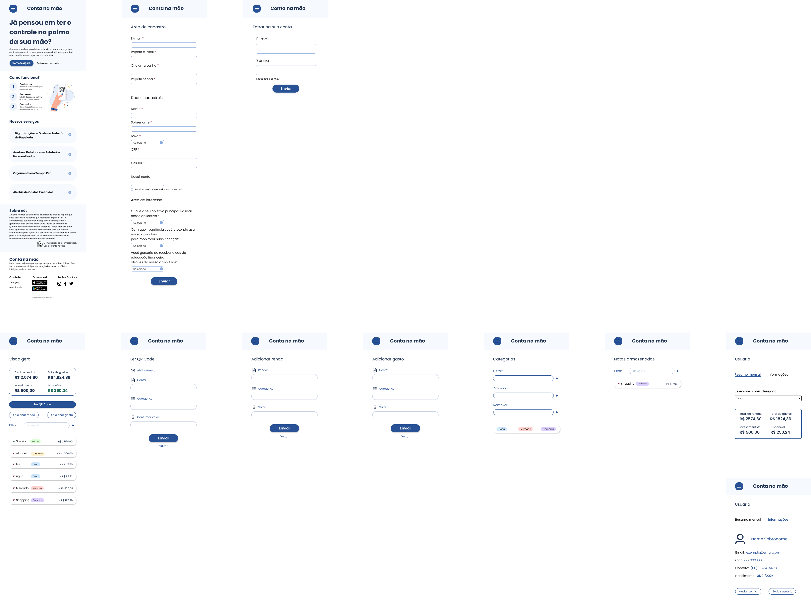
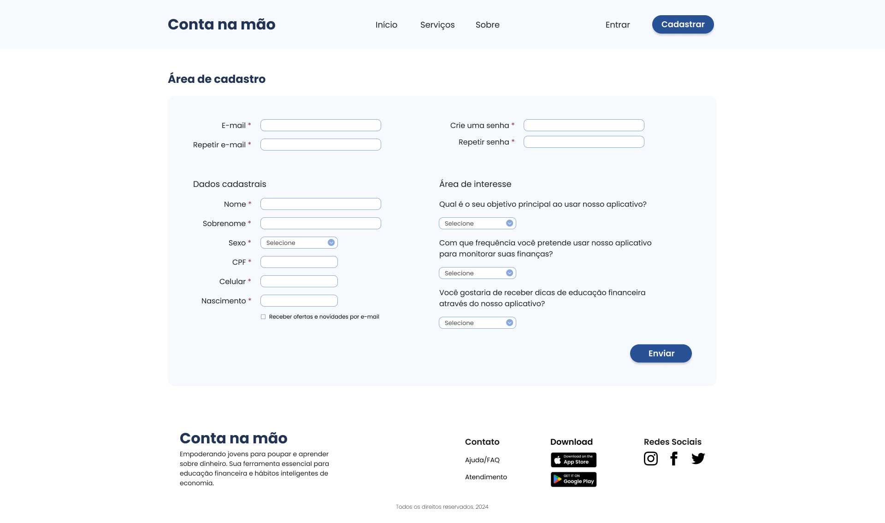
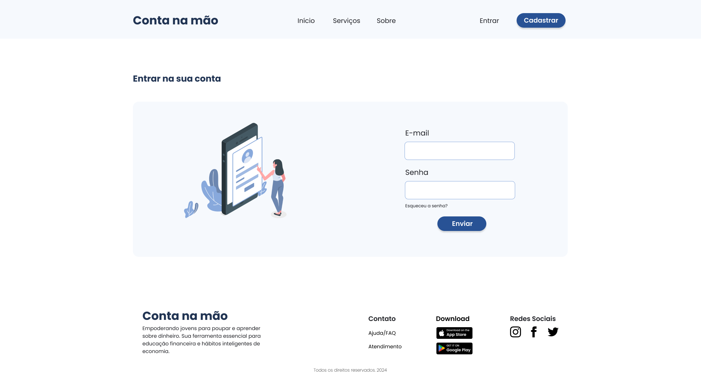
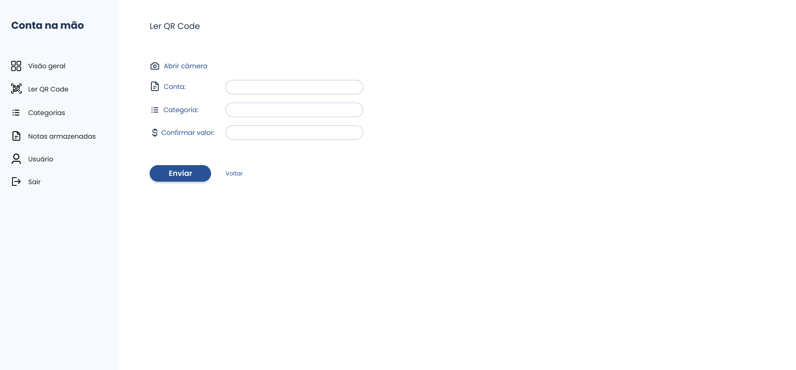
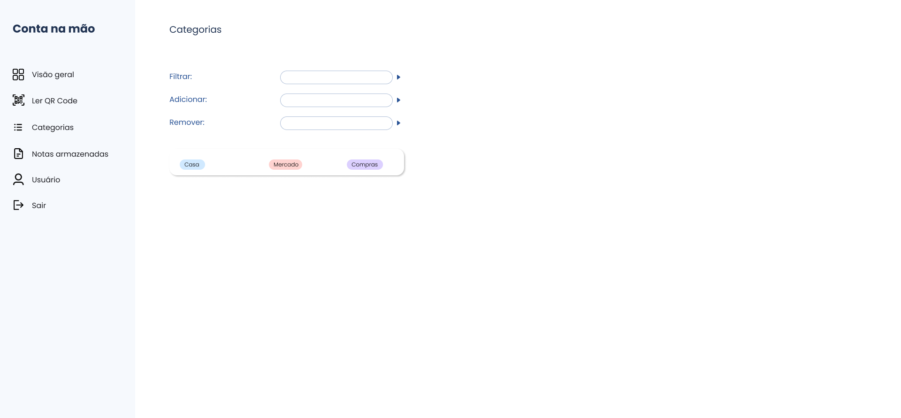
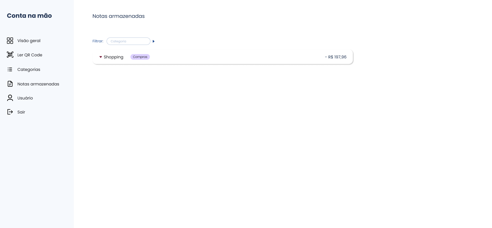

# Projeto de Interface

## User Flow

O fluxograma apresentado na figura 1 mostra o fluxo em que o usuário poderá percorrer pelas telas do sistema, garantindo uma navegabilidade fluida.

<figure> 
    <figcaption>Figura 1 - Fluxo de telas do usuário
</figure>

## Protótipo de baixa fidelidade

Nosso protótipo de baixa qualidade é uma representação simples da interface do usuário, permitindo a visualização básica da estrutura das páginas, contribuindo como base desde o início do desenvolvimento.

No protótipo, buscamos apenas organizar visualmente a aplicação, com foco em otimizar o espaço da tela para proporcionar a melhor experiência ao usuário.

<figure> 
    <figcaption>Figura 2 - Protótipo de baixa fidelidade
</figure>

## Protótipo

Apresentação geral do fluxo de telas.

<figure> 
    <figcaption>Figura 3 - Protótipo da versão Desktop
</figure>

<figure> 
    <figcaption>Figura 4 - Protótipo da versão Mobile
</figure>

## Versão Desktop

### Página inicial

A tela inicial apresenta banners, cards e imagens ilustrativas que direcionam o cliente para a página de login ou cadastro, caso seja novo usuário.

<figure> 
    <figcaption>Figura 5 - Protótipo da página inicial da versão Desktop
</figure>

### Página de cadastro

A tela de cadastro possui formulário para inserir diversos dados pessoais e área de interesse do usuário.

<figure> 
    <figcaption>Figura 6 - Protótipo da página cadastro da versão Desktop
</figure>

### Página de login

A tela de login apresenta campos para inserir e-mail e senha do usuário já cadastrado.

<figure> 
    <figcaption>Figura 7 - Protótipo da página login da versão Desktop
</figure>
 
### Página de Visão geral
 A tela de visão geral apresenta todas as contas inseridas do usuário, com atualização em tempo real de seu saldo.
 

<figure> 
    <figcaption>Figura 8 - Protótipo da página visão geral da versão Desktop
</figure>

### Página de Ler QR Code

A tela de ler QR Code apresenta um breve formulário de inserção do cadastro da nota física, nome da conta, categoria e confirmação do valor.

<figure> 
    <figcaption>Figura 9 - Protótipo da página Ler QR Code da versão Desktop
</figure>

### Página de Adicionar renda

A tela de adicionar renda apresenta um breve formulário de inserção de renda, categoria e valor.

<figure> 
    <figcaption>Figura 10 - Protótipo da página adicionar renda da versão Desktop
</figure>

### Página de Adicionar gasto

A tela de adicionar gasto apresenta um breve formulário de inserção de gasto, categoria e valor.

<figure> 
    <figcaption>Figura 11 - Protótipo da página adicionar gasto da versão Desktop
</figure>

### Página de Categorias

A tela de categorias apresenta um breve formulário com filtro, adição e subtração de categorias..

<figure> 
    <figcaption>Figura 12 - Protótipo da página categorias da versão Desktop
</figure>

### Página de Usuário

A tela de usuário apresenta um breve resumo mensal do usuário e uma breve informação da conta do usuário logada, possibilitando a troca de senha ou exclusão de usuário.

<figure> 
    <figcaption>Figura 13.1 e 13.2 - Protótipo da página usuário da versão Desktop
</figure>

### Página de Notas

A tela de notas apresenta um breve resumo de todas as notas cadastradas, possibilitando a filtragem por categorias delas.

<figure> 
    <figcaption>Figura 14 - Protótipo da página de notas da versão Desktop
</figure>
