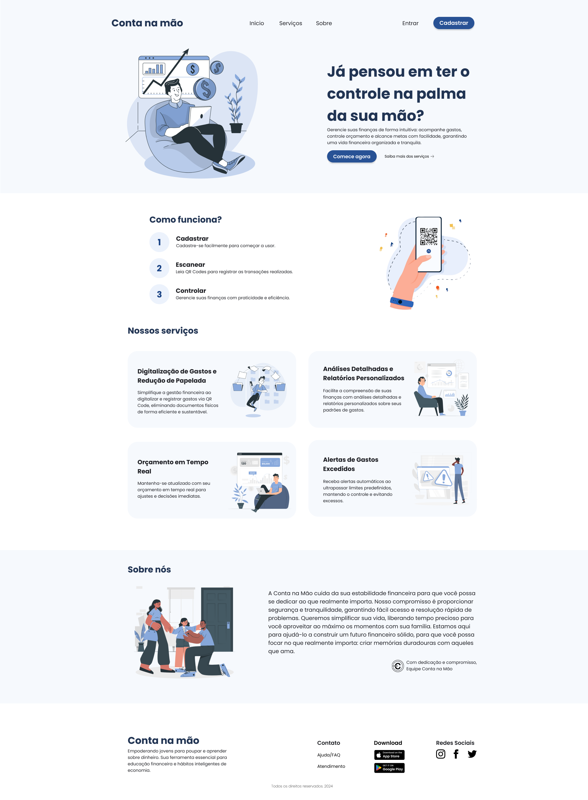

# Template padrão da Aplicação

Layout padrão do site (HTML e CSS) que será utilizado em todas as páginas com a definição de identidade visual, aspectos de responsividade e iconografia.

As páginas terão como elementos padrões o menu de navegação, header e o footer, além dos elementos de identidade visual citados abaixo:
- Cores (RBG): #285295, #213453, #f6f9fd, #1e1f24;
- Font-family: "Poppins", sans-serif;
- Font-size: 48px, 28px, 18px, 14px;

O código utilizado para a construção dos elementos citados, incluindo a responsividade, pode ser consultado <a href="https://github.com/ICEI-PUC-Minas-PMV-ADS/pmv-ads-2024-1-e1-proj-web-t09-conta-na-mao/tree/main/codigo-fonte">aqui</a>. As imagens e ícones utilizados no projeto estão disponíveis <a href="https://github.com/ICEI-PUC-Minas-PMV-ADS/pmv-ads-2024-1-e1-proj-web-t09-conta-na-mao/tree/main/codigo-fonte/src/imagens">aqui</a>.

### Tela inicial

Exibe o funcionamento e os serviços oferecidos pela plataforma.

<figure> 
    <figcaption>Figura 1 - Página inicial da versão Desktop
</figure>
