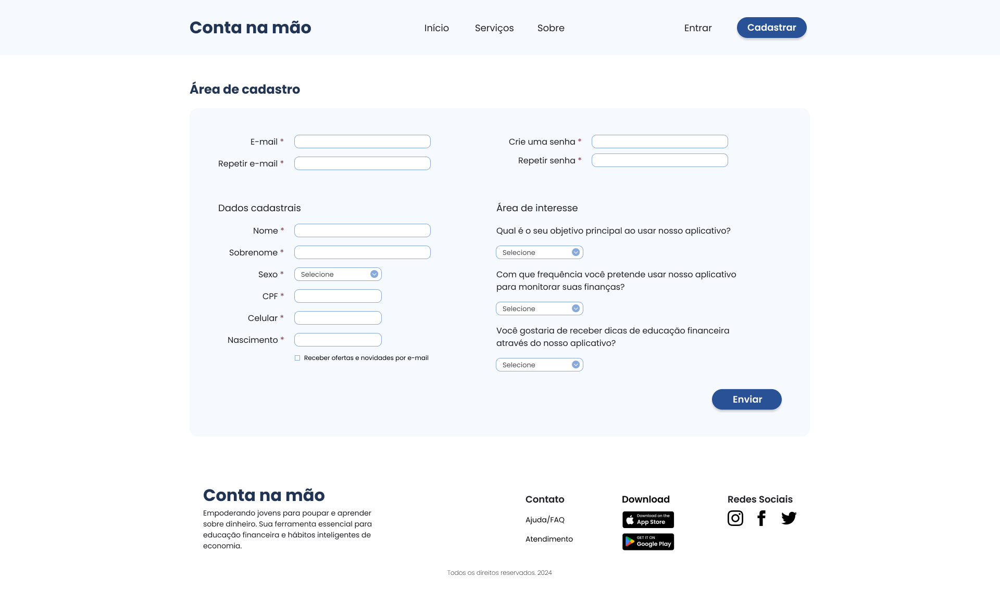
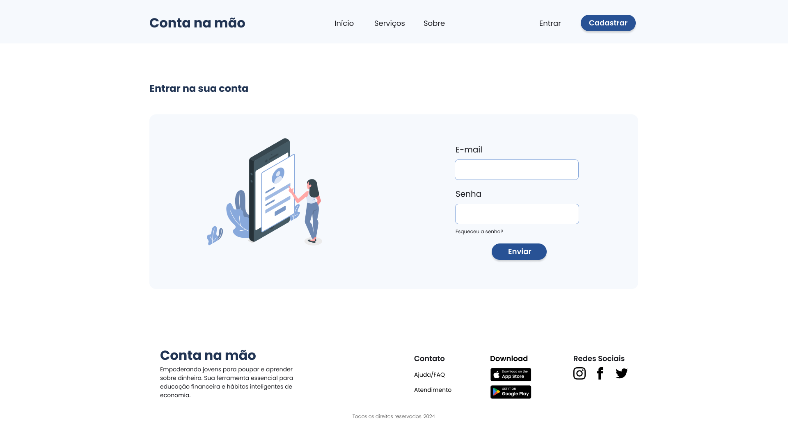
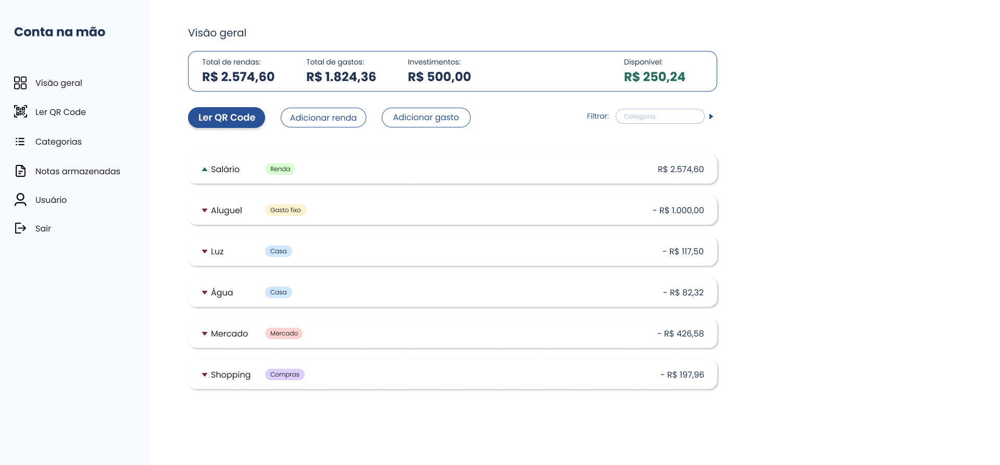

# Programação de Funcionalidades

Implementação da aplicação descritas por meio dos requisitos codificados. 

Pré-requisitos: <a href="https://github.com/ICEI-PUC-Minas-PMV-ADS/pmv-ads-2024-1-e1-proj-web-t09-conta-na-mao/blob/main/documentos/02-Especifica%C3%A7%C3%A3o%20do%20Projeto.md"> Especificação do Projeto</a>, <a href="https://github.com/ICEI-PUC-Minas-PMV-ADS/pmv-ads-2024-1-e1-proj-web-t09-conta-na-mao/blob/main/documentos/03-Metodologia.md"> Metodologia</a>, <a href="https://github.com/ICEI-PUC-Minas-PMV-ADS/pmv-ads-2024-1-e1-proj-web-t09-conta-na-mao/blob/main/documentos/04-Projeto%20de%20Interface.md"> Projeto de Interface</a>.

### Tela de cadastro

#### Requisito atendido

- RF-01	Os usuários devem ter a opção de se cadastrar na plataforma

#### Artefatos da funcionalidade

- cadastro.html
- cadastro.css

#### Estrutura de Dados

- <a href="../codigo-fonte/src/cadastro/cadastro.html">cadastro.html</a>

#### Instruções de acesso

Abra um navegador de Internet e informe a seguinte URL: https://icei-puc-minas-pmv-ads.github.io/pmv-ads-2024-1-e1-proj-web-t09-conta-na-mao/codigo-fonte/src/cadastro/cadastro.html

Ao clicar em “Cadastrar” no canto superior direito da tela, terá acesso a página de cadastro.

#### Responsável

Railan Leão

### Tela de login

#### Requisito atendido

- RF-02	Os usuários só poderão acessar as informações após efetuarem o login na plataforma

#### Artefatos da funcionalidade

- login.html
- login.css

#### Estrutura de Dados

- <a href="../codigo-fonte/src/login/login.html">login.html</a>

#### Instruções de acesso

Abra um navegador de Internet e informe a seguinte URL: https://icei-puc-minas-pmv-ads.github.io/pmv-ads-2024-1-e1-proj-web-t09-conta-na-mao/codigo-fonte/src/index.html

Ao clicar em Entrar no canto superior direito da tela, terá acesso a página de login.

#### Responsável

Angelo

### Tela Dashboard

#### Requisito atendido

- RF-03	Os usuários devem poder armazenar seus cupons ficcais
- RF-04	Os usuários devem ter a capacidade de categorizar seus cupons conforme desejaram
- RF-05	OS usuários devem ter uma seção dedicada para editar as informações pessoais que inseriram
- RF-06	Os usuários poderão visualizar, ao final de cada mês, onde ocorreram seus maiores gastos

#### Artefatos da funcionalidade

- dashboard.html
- dashboard.css

#### Estrutura de Dados

- <a href="../codigo-fonte/src/dashboard/dashboard.html">dashboard.html</a>

#### Instruções de acesso

Abra um navegador de Internet e informe a seguinte URL: https://icei-puc-minas-pmv-ads.github.io/pmv-ads-2024-1-e1-proj-web-t09-conta-na-mao/codigo-fonte/src/index.html

Ao clicar em Entrar no canto superior direito da tela e ter o acesso de sua conta, o usuário será redirecionado para a página Dashboard.

#### Responsável

Karina Nunes

> **Links Úteis**:
> - [Trabalhando com HTML5 Local Storage e JSON](https://www.devmedia.com.br/trabalhando-com-html5-local-storage-e-json/29045)
> - [JSON Tutorial](https://www.w3resource.com/JSON)
> - [JSON - Introduction (W3Schools)](https://www.w3schools.com/js/js_json_intro.asp)
> - [JSON Tutorial (TutorialsPoint)](https://www.tutorialspoint.com/json/index.htm)

